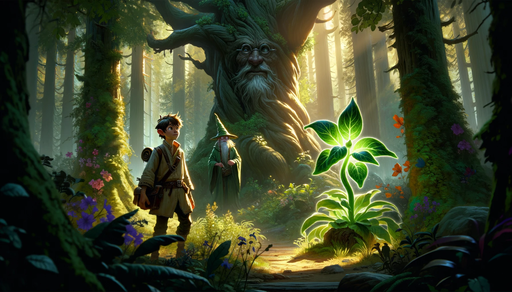
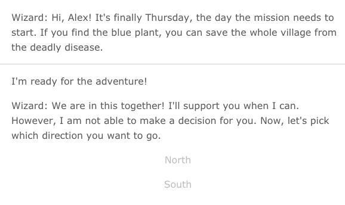

Save the Village is a text-based interactive game. 
 
 
 
The player is on a mission to find the magic plant in the forest to save the village. A wizard, filled with character, shadows the player throughout the journey. 
 

